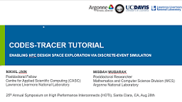

.. _tutorial:

Tutorial
========

.. rubric:: Slides

`Download Slides <http://www.hoti.org/tutorials/HOTI25_Tutorial_2c.pdf>`_.

**Full citation:** Nikhil Jain and Misbah Mubarak.
`CODES-TRACER Tutorial: Enabling HPC Design Space
Exploration via Discrete-Event Simulation
<http://www.hoti.org/tutorials/HOTI25_Tutorial_2c.pdf>`_.
Tutorial presented at 25th Annual Symposium on High Performance
Interconnects (HOTI). Aug 28, 2017, Santa Clara, CA, USA.

.. rubric:: Guides

These guides will give some of the basics needed to use TraceR.
1. :ref:`tutorial/network_models`
2. :ref:`tutorial/simulation_basics`
3. :ref:`tutorial/workflow`

Full contents:

.. toctree::
   tutorial/network_models
   tutorial/simulation_basics
   tutorial/workflow